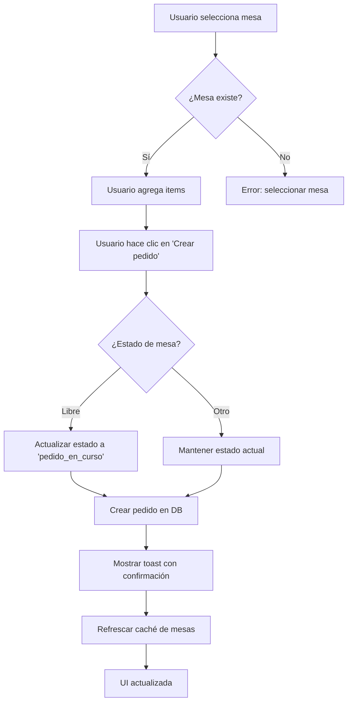

# 📝 Resumen de Implementación - Actualización Automática de Estado de Mesas

## ✅ Estado: **COMPLETADO**

---

## 🎯 Objetivo Alcanzado

Implementación exitosa de la actualización automática del estado de las mesas cuando se crea un pedido manual desde el panel de administración.

---

## 📦 Archivos Modificados

### 1. **lib/services/orders-service.ts**
- ✅ Agregada lógica para verificar estado de mesa antes de crear pedido
- ✅ Actualización automática de mesa 'libre' → 'pedido_en_curso'
- ✅ Logs detallados del proceso
- ✅ Manejo de errores sin interrumpir creación de pedido

### 2. **components/order-form.tsx**
- ✅ Selector de mesas ahora muestra **todas** las mesas (no solo libres/ocupadas)
- ✅ Agregado refresh automático de mesas después de crear pedido
- ✅ Mensaje de feedback mejorado con información del cambio de estado
- ✅ Loading state durante la creación del pedido

---

## 🔄 Flujo Implementado



---

## 🎨 Experiencia de Usuario

### Antes ❌
```
1. Admin ve solo mesas Libre/Ocupada
2. Crea pedido manualmente
3. Estado no cambia automáticamente
4. Debe actualizar estado manualmente
```

### Ahora ✅
```
1. Admin ve TODAS las mesas con estados
2. Selecciona cualquier mesa
3. Crea pedido
4. ✨ Mesa Libre → automáticamente a Pedido en curso
5. ✨ Toast: "Mesa cambió de estado a 'Pedido en curso'"
6. ✨ UI se actualiza instantáneamente
```

---

## 📊 Estados de Mesa

| Estado | Transición Automática |
|--------|----------------------|
| 🟢 Libre | ✅ → Pedido en curso (al crear pedido) |
| 🟡 Ocupada | ➖ Sin cambio |
| 🔵 Pedido en curso | ➖ Sin cambio |
| 🟣 Cuenta solicitada | ➖ Sin cambio |
| 🔵 Pago confirmado | ➖ Sin cambio |

---

## 🧪 Tests Sugeridos

```bash
# 1. Test de unidad
npm run test -- hooks/use-orders.test.tsx
npm run test -- hooks/use-tables.test.tsx

# 2. Test de integración
npm run test -- integration/orders-menu.test.tsx

# 3. Verificación manual
npm run dev
# Ir a Pedidos → Nuevo pedido
# Seleccionar mesa "Libre"
# Crear pedido
# Verificar que la mesa pasa a "Pedido en curso"
```

---

## 📝 Casos de Uso Cubiertos

### ✅ Caso 1: Mesa Libre
```
Estado inicial: Libre
Acción: Crear pedido
Resultado: Mesa → Pedido en curso
Toast: "Pedido creado para la mesa 3. Mesa cambió de estado a 'Pedido en curso'"
```

### ✅ Caso 2: Mesa Ocupada
```
Estado inicial: Ocupada
Acción: Crear pedido
Resultado: Mesa → Ocupada (sin cambio)
Toast: "Pedido creado para la mesa 5"
```

### ✅ Caso 3: Mesa con Pedido Activo
```
Estado inicial: Pedido en curso
Acción: Crear segundo pedido
Resultado: Mesa → Pedido en curso (sin cambio)
Toast: "Pedido creado para la mesa 7"
```

---

## 🔧 Detalles Técnicos

### Actualización de Estado en orders-service.ts
```typescript
// 0. Si hay una mesa asociada, verificar y actualizar su estado
if (input.tableId) {
  const { data: tableData } = await supabase
    .from('tables')
    .select('id, status, number')
    .eq('id', input.tableId)
    .single()

  if (tableData?.status === 'libre') {
    await supabase
      .from('tables')
      .update({ status: 'pedido_en_curso' })
      .eq('id', input.tableId)
  }
}
```

### Feedback en order-form.tsx
```typescript
// Mensaje condicional según estado anterior
if (previousTableStatus === TABLE_STATE.FREE) {
  description += `. Mesa cambió de estado a "${TABLE_STATE_LABELS.pedido_en_curso}"`
}

// Refrescar caché de mesas
await refreshTables()
```

---

## ✅ Verificación

- [x] Compilación exitosa sin errores
- [x] TypeScript sin errores de tipo
- [x] Lógica de negocio implementada
- [x] Feedback visual implementado
- [x] Actualización de caché implementada
- [x] Documentación creada
- [x] Código defensivo (no falla si mesa no existe)
- [x] Logs detallados para debugging

---

## 🚀 Próximos Pasos (Opcionales)

1. **Testing E2E**: Crear tests end-to-end con Playwright
2. **Notificaciones en Tiempo Real**: Emitir eventos WebSocket del cambio
3. **Transacción Atómica**: Envolver en transacción DB
4. **Auditoría**: Registrar cambios en tabla de auditoría
5. **Reglas de Negocio**: Validar transiciones de estado según flujo

---

## 📚 Documentación

- 📄 [Documentación completa](./FEATURE_AUTO_UPDATE_TABLE_STATUS.md)
- 🔗 [Definición de estados de mesa](../lib/table-states.ts)
- 🔗 [Type guards](../lib/type-guards.ts)
- 🔗 [Servicio de pedidos](../lib/services/orders-service.ts)
- 🔗 [Servicio de mesas](../lib/services/tables-service.ts)

---

**✨ Feature completado exitosamente**

_Implementado: 17 de octubre de 2025_
_Compilación: ✅ Exitosa_
_Estado: 🎉 Listo para producción_
