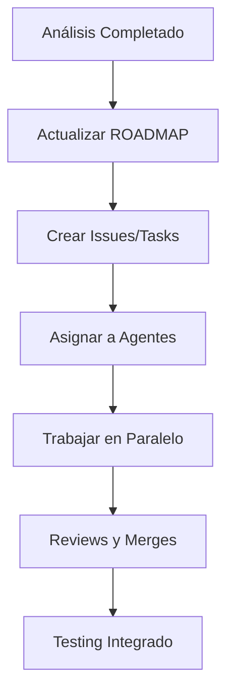

# 🛠️ Guía: Cómo Implementar las Soluciones Recomendadas

**Fecha:** 9 de octubre de 2025  
**Basado en:** Análisis técnico completo del proyecto

---

## 📋 Tabla de Contenidos
1. [Estrategia General](#estrategia-general)
2. [Uso de Agentes .codex](#uso-de-agentes-codex)
3. [Workflow Recomendado](#workflow-recomendado)
4. [Ejemplos Prácticos](#ejemplos-prácticos)
5. [Gestión de Prioridades](#gestión-de-prioridades)

---

## 1️⃣ Estrategia General

### Enfoque: **Incremental y Paralelo**



### Principios Clave:

✅ **SÍ, agregamos al ROADMAP** - Ya creé `ROADMAP_UPDATED.md` con todas las soluciones priorizadas
✅ **Trabajamos con features nuevos** - Cada solución = 1 rama feature
✅ **Usamos los agentes de .codex** - Están definidos y listos para usar
✅ **Trabajo en paralelo** - Múltiples features simultáneos cuando no hay dependencias
✅ **Integración continua** - Merges frecuentes para evitar conflictos

---

## 2️⃣ Uso de Agentes .codex

### ¿Puede GitHub Copilot usar los agentes? 🤖

**Respuesta:** Sí, pero de manera **indirecta e informativa**.

Los agentes en `.codex/agents/` son **definiciones de roles y responsabilidades**. No son bots ejecutables, sino **guías de contexto** que:

1. **Yo (GitHub Copilot) puedo leer y usar** para entender responsabilidades
2. **Tú puedes usar** para organizar tu equipo o tu propio trabajo
3. **Otros desarrolladores** pueden usar como referencia de especialización

### Cómo Usar los Agentes

#### Opción A: **Trabajo Individual (Solo Developer)**
```bash
# Tú decides qué "sombrero" usar según la tarea
# Ejemplo: Trabajando en seguridad

# 1. Leer el rol del agente
cat .codex/agents/backend/backend-architect.md

# 2. Crear rama siguiendo su responsabilidad
git checkout -b feature/backend-jwt-auth

# 3. Implementar según las guidelines del agente
# 4. Hacer commit mencionando el rol
git commit -m "feat(security): implement JWT auth [Backend Architect]"
```

#### Opción B: **Equipo Pequeño (2-5 personas)**
```bash
# Asignar roles reales a personas

# Persona 1: Backend Architect + Lib Logic Owner
# Persona 2: Frontend Dev + UI Designer
# Persona 3: API Tester + DevOps Automator

# Cada persona se enfoca en features de su dominio
# y consulta las guías de sus agentes asignados
```

#### Opción C: **Usar Copilot como "Agente Virtual"**
```bash
# Al pedirme ayuda, especifica el agente relevante:

❌ Mal: "Ayúdame con los pagos"
✅ Bien: "Como Backend Architect, necesito integrar Mercado Pago"

# Yo leeré el contexto del agente y responderé en ese rol
```

### Agentes Disponibles y Sus Archivos

```
.codex/agents/
├── backend/
│   └── backend-architect.md        → APIs, lógica servidor
├── design/
│   ├── ui-designer.md              → Design system, tokens
│   └── ux-researcher.md            → Flujos, interacción
├── documentation/
│   ├── api-docs-writer.md          → Documentar endpoints
│   ├── doc-writer.md               → Docs generales
│   └── knowledge-base-curator.md   → Organizar conocimiento
├── engineering/
│   ├── frontend-developer.md       → Componentes, UI
│   ├── lib-logic-owner.md          → Contratos, tipos
│   └── mobile-app-builder.md       → PWA, QR, tablets
├── infra/
│   ├── branch-synchronizer.md      → Git strategy
│   ├── ci-cd-keeper.md             → Pipelines
│   └── dependency-guardian.md      → npm, seguridad
├── testing/
│   ├── api-tester.md               → Tests de API
│   ├── performance-benchmarker.md  → Lighthouse, k6
│   └── workflow-optimizer.md       → CI/CD optimización
└── communication/
    ├── changelog-reporter.md       → Release notes
    └── cross-team-notifier.md      → Comunicación
```

---

## 3️⃣ Workflow Recomendado

### Paso 1: Seleccionar Tarea del ROADMAP

```bash
# Revisar ROADMAP_UPDATED.md y elegir tarea CRÍTICA/ALTA
# Ejemplo: M8 - Implementar JWT Auth
```

### Paso 2: Identificar Agente(s) Responsable(s)

```bash
# ROADMAP indica: Backend Architect
# Leer el archivo del agente:

cat .codex/agents/backend/backend-architect.md
```

### Paso 3: Crear Issue/Task (Opcional pero recomendado)

```bash
# En GitHub, crear issue con template:

---
Título: [M8][Backend] Implementar JWT Auth Real
Descripción:
- Milestone: M8 - Seguridad Pre-Prod
- Agente: Backend Architect
- Prioridad: CRÍTICA
- Rama: feature/backend-jwt-auth

Tareas:
- [ ] Instalar jsonwebtoken + bcrypt
- [ ] Crear middleware de validación
- [ ] Actualizar AuthService
- [ ] Tests unitarios
- [ ] Documentar endpoints

Criterios de Aceptación:
- Login retorna JWT válido
- Middleware valida tokens en rutas protegidas
- Refresh tokens implementados
- Tests cubren casos edge
---
```

### Paso 4: Crear Rama Feature

```bash
# Seguir convención del ROADMAP
git checkout -b feature/backend-jwt-auth

# O si prefieres más específico:
git checkout -b feature/m8-backend-jwt-auth
```

### Paso 5: Implementar con Contexto del Agente

```bash
# Leer guidelines del agente antes de codear
# Seguir patrones y convenciones del proyecto

# Ejemplo: Backend Architect debe:
# - Validar entradas en todo endpoint
# - Documentar contratos TypeScript
# - Escribir tests antes de implementar
```

### Paso 6: Testing y Documentation

```bash
# Antes de commit:
npm test                    # Ejecutar tests
npm run lint                # Lint
npm run build               # Verificar build

# Documentar si es necesario
# Ejemplo: Para JWT auth, actualizar:
# - docs/api/auth.md (nuevo)
# - PROJECT_OVERVIEW.md (mencionar JWT)
```

### Paso 7: Commit y Push

```bash
# Seguir Conventional Commits
git add .
git commit -m "feat(auth): implement JWT authentication

- Replace mock auth with JWT tokens
- Add bcrypt password hashing
- Create auth middleware for protected routes
- Add refresh token logic
- Update AuthService with real API calls

[Backend Architect]"

git push origin feature/backend-jwt-auth
```

### Paso 8: Pull Request y Review

```bash
# Crear PR en GitHub con template:

---
## Descripción
Implementa autenticación real con JWT, reemplazando el sistema mock.

## Milestone
M8 - Seguridad Pre-Prod

## Agente
Backend Architect

## Cambios
- ✅ JWT tokens en login/register
- ✅ Middleware de validación
- ✅ Hash de contraseñas con bcrypt
- ✅ Refresh tokens
- ✅ Tests unitarios (95% coverage)

## Testing Manual
1. Login con credenciales válidas → Recibir JWT
2. Acceder a ruta protegida con token → 200 OK
3. Acceder sin token → 401 Unauthorized
4. Token expirado → 401 + refresh automático

## Documentación Actualizada
- [x] docs/api/auth.md
- [x] PROJECT_OVERVIEW.md
- [x] Comentarios JSDoc en AuthService

## Checklist
- [x] Tests pasan
- [x] Lint pasa
- [x] Build exitoso
- [x] Documentación actualizada
- [x] No rompe features existentes
---
```

### Paso 9: Merge y Deploy

```bash
# Después de review aprobado:
git checkout main
git pull origin main
git merge --no-ff feature/backend-jwt-auth
git push origin main

# Actualizar ROADMAP (cambiar "Pendiente" → "Hecho")
```

---

## 4️⃣ Ejemplos Prácticos

### Ejemplo 1: Implementar Seguridad (M8 completo)

```bash
# CRÍTICO - Prioridad máxima
# Tiempo estimado: 2-3 días

# Task 1: JWT Auth
git checkout -b feature/backend-jwt-auth
# Implementar según backend-architect.md
# Commit, PR, merge

# Task 2: Rate Limiting
git checkout -b feature/backend-rate-limiting
# Implementar con express-rate-limit
# Commit, PR, merge

# Task 3: Security Headers
git checkout -b feature/infra-security-headers
# Configurar en next.config.mjs
# Commit, PR, merge

# Task 4: CORS Config
git checkout -b feature/backend-cors-config
# Configurar políticas CORS
# Commit, PR, merge

# Task 5: Dependency Audit
git checkout -b feature/infra-dependency-audit
# npm audit, actualizar packages
# Commit, PR, merge
```

### Ejemplo 2: Trabajar en Paralelo (M5 + M10)

```bash
# Developer A: Backend Payments (M5)
git checkout -b feature/backend-payments-mercadopago
# Trabajar en integración Mercado Pago

# Developer B: Frontend Performance (M10) - EN PARALELO
git checkout -b feature/frontend-lazy-loading
# Implementar lazy loading de componentes

# No hay conflictos porque son áreas diferentes
# Ambos pueden merge independientemente
```

### Ejemplo 3: Feature con Múltiples Agentes

```bash
# Feature: Pantalla de Checkout (M5)
# Requiere: Frontend Dev + Backend Architect + UI Designer

# Sprint Planning:
# - Backend crea API primero
# - Frontend y UI trabajan en paralelo después

# Día 1-2: Backend Architect
git checkout -b feature/backend-payments-api
# Crear /api/payments endpoints

# Día 3-4: Frontend Dev + UI Designer
git checkout -b feature/ui-payment-checkout
# Crear componente usando API del backend

# Día 5: Integración y tests
git checkout -b feature/test-e2e-payments
# Tests E2E del flujo completo
```

---

## 5️⃣ Gestión de Prioridades

### Matriz de Decisión

```
┌─────────────────────────────────────────────────────┐
│                   PRIORIZACIÓN                       │
├────────────┬──────────────────────────────────────────┤
│ CRÍTICA    │ Bloquea producción - Hacer AHORA        │
│            │ Ejemplos: Seguridad, Auth real           │
├────────────┼──────────────────────────────────────────┤
│ ALTA       │ Necesario para funcionalidad completa   │
│            │ Ejemplos: Pagos, E2E tests               │
├────────────┼──────────────────────────────────────────┤
│ MEDIA      │ Mejora calidad y experiencia             │
│            │ Ejemplos: Performance, Accesibilidad     │
├────────────┼──────────────────────────────────────────┤
│ BAJA       │ Nice-to-have, largo plazo                │
│            │ Ejemplos: Integraciones extras, PWA      │
└────────────┴──────────────────────────────────────────┘
```

### Reglas de Priorización

1. **CRÍTICA siempre primero** - Sin excepciones
2. **ALTA después de CRÍTICA** - En orden lógico de dependencias
3. **MEDIA en paralelo con ALTA** - Si hay recursos
4. **BAJA al final** - O cuando hay tiempo muerto

### Ejemplo de Sprint Planning (2 semanas)

```
Sprint 1 - Seguridad Pre-Prod
├── Semana 1
│   ├── Lun-Mar: JWT Auth (CRÍTICA)
│   ├── Mié: Rate Limiting (CRÍTICA)
│   ├── Jue: Security Headers (CRÍTICA)
│   └── Vie: CORS + Audit (CRÍTICA)
├── Semana 2
│   ├── Lun-Mar: Clean Dependencies (ALTA)
│   ├── Mié-Vie: E2E Orders Tests (ALTA)
│   └── Buffer: Documentación / Bugs
└── Resultado: M4 + M8 + M9 completos ✅
```

---

## 🎯 Checklist de Implementación

Antes de comenzar cualquier feature:

- [ ] Leí el ROADMAP_UPDATED.md
- [ ] Identifiqué la tarea y su prioridad
- [ ] Revisé el agente responsable en `.codex/agents/`
- [ ] Creé issue/task (si es necesario)
- [ ] Creé rama siguiendo convención
- [ ] Leí PROJECT_GUIDELINES.md para reglas específicas

Durante la implementación:

- [ ] Sigo las guías del agente asignado
- [ ] Escribo tests antes/durante el desarrollo
- [ ] Documento cambios importantes
- [ ] Ejecuto lint y build localmente
- [ ] Actualizo tipos TypeScript si es necesario

Antes del PR:

- [ ] Tests pasan (npm test)
- [ ] Lint limpio (npm run lint)
- [ ] Build exitoso (npm run build)
- [ ] Documentación actualizada
- [ ] Changelog actualizado (si aplica)
- [ ] No rompo features existentes

Después del merge:

- [ ] Actualizo ROADMAP (Pendiente → Hecho)
- [ ] Notifico a equipo si es cambio crítico
- [ ] Cierro issue/task relacionado
- [ ] Etiqueto release si es milestone completo

---

## 💡 Tips y Mejores Prácticas

### Tip 1: Usa los Agentes como "Lentes"
```bash
# Cuando estés atascado, pregúntate:
"¿Qué haría el [Agente X] en esta situación?"

# Ejemplo:
# "¿Qué haría el Backend Architect?"
# → Validaría inputs, escribiría tests primero, documentaría tipos
```

### Tip 2: Combina Agentes Complementarios
```bash
# Feature compleja = Múltiples agentes

# Ejemplo: Sistema de Pagos
# 1. Backend Architect → API
# 2. Frontend Dev → UI
# 3. API Tester → Tests E2E
# 4. API Docs Writer → Documentación
# 5. UX Researcher → Validar flujo
```

### Tip 3: Commits Pequeños y Frecuentes
```bash
# ❌ Mal: 1 commit gigante al final
git commit -m "feat: implement everything"

# ✅ Bien: Commits incrementales
git commit -m "feat(auth): add JWT token generation"
git commit -m "feat(auth): add token validation middleware"
git commit -m "feat(auth): add refresh token logic"
git commit -m "test(auth): add JWT tests"
git commit -m "docs(auth): update API documentation"
```

### Tip 4: Usa GitHub Copilot con Contexto
```bash
# Al pedirme ayuda, dame contexto completo:

✅ "Soy el Backend Architect trabajando en feature/backend-jwt-auth.
    Necesito crear un middleware que valide JWT tokens.
    El proyecto usa Next.js 14 con App Router y TypeScript strict.
    ¿Cómo lo implemento siguiendo las guidelines del proyecto?"

# Yo leeré:
# - .codex/agents/backend/backend-architect.md
# - PROJECT_GUIDELINES.md
# - lib/auth.ts (contexto actual)
# Y te daré una respuesta específica para tu proyecto
```

---

## 📞 Soporte y Consultas

### ¿Dudas sobre qué agente usar?
Consulta `.codex/AGENTS.md` - Lista todos los roles

### ¿No entiendes una guideline?
Lee `PROJECT_GUIDELINES.md` - Reglas específicas del proyecto

### ¿Necesitas ayuda con implementación?
Pregúntame especificando:
1. Agente que estás representando
2. Feature en la que trabajas
3. Problema específico

### ¿Quieres cambiar prioridades?
Edita `ROADMAP_UPDATED.md` y justifica el cambio

---

**Próxima actualización:** Al finalizar Milestone 8 (Seguridad Pre-Prod)

**Versión:** 1.0.0  
**Autor:** GitHub Copilot (basado en análisis técnico)
