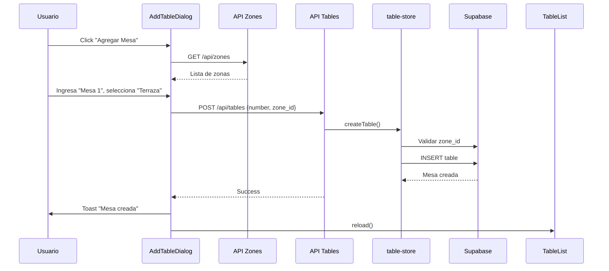
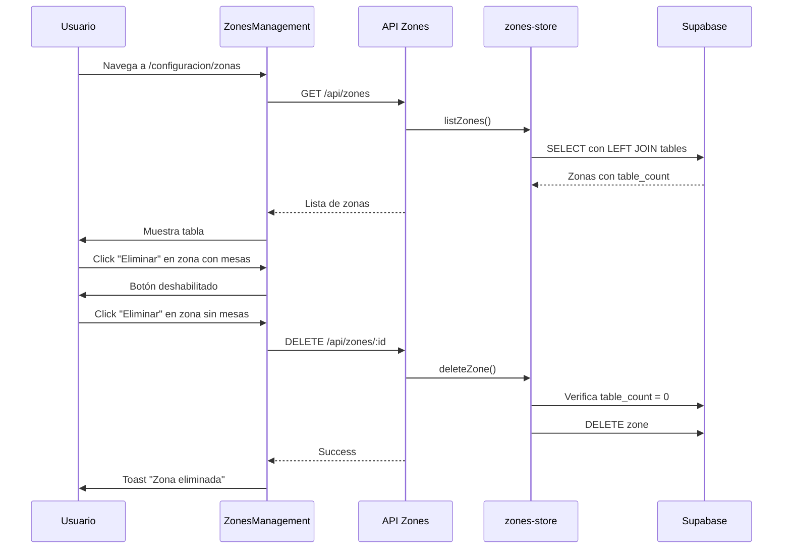

# Implementación del Sistema de Zonas

## Resumen

Se ha implementado un sistema completo de gestión de zonas para organizar las mesas del restaurante por áreas físicas. Este sistema permite:

- Crear, editar y eliminar zonas
- Asignar mesas a zonas específicas
- Filtrar y agrupar mesas por zona
- Identificadores flexibles para mesas (texto en lugar de solo números)

## Cambios en la Base de Datos

### 1. Nueva Tabla: `zones`

```sql
CREATE TABLE zones (
  id UUID PRIMARY KEY DEFAULT gen_random_uuid(),
  tenant_id UUID NOT NULL REFERENCES tenants(id) ON DELETE CASCADE,
  name VARCHAR(100) NOT NULL,
  description TEXT,
  sort_order INTEGER NOT NULL DEFAULT 0,
  active BOOLEAN NOT NULL DEFAULT true,
  created_at TIMESTAMPTZ NOT NULL DEFAULT now(),
  updated_at TIMESTAMPTZ NOT NULL DEFAULT now(),
  UNIQUE(tenant_id, name)
);
```

**Características:**
- Multitenancy con aislamiento por RLS
- Orden personalizable para visualización
- Estado activo/inactivo
- Restricción de unicidad por tenant

**RLS Policies:**
```sql
-- SELECT: Ver solo zonas del tenant
CREATE POLICY "zones_select_own_tenant" ON zones FOR SELECT
  USING (tenant_id = current_setting('app.current_tenant')::uuid);

-- INSERT/UPDATE/DELETE: Solo usuarios autenticados del tenant
CREATE POLICY "zones_modify_own_tenant" ON zones FOR ALL
  USING (tenant_id = current_setting('app.current_tenant')::uuid);
```

### 2. Migración de Tabla `tables`

**Cambios aplicados:**

1. **Campo `number`**: `INTEGER` → `TEXT`
   - Permite identificadores flexibles: "1", "Mesa 1", "M1", "A1", etc.
   - Preserva datos existentes convirtiendo números a texto

2. **Campo de zona**: `zone TEXT` → `zone_id UUID`
   - Foreign key a `zones.id`
   - `ON DELETE SET NULL` para preservar mesas si se elimina zona
   - Migración automática: crea zonas temporales desde valores TEXT existentes

```sql
-- Antes
number INTEGER NOT NULL
zone TEXT

-- Después
number TEXT NOT NULL
zone_id UUID REFERENCES zones(id) ON DELETE SET NULL
```

### 3. Zonas por Defecto

Trigger que crea automáticamente 5 zonas para cada nuevo tenant:

1. Salón Principal (sort_order: 0)
2. Terraza (sort_order: 1)
3. Patio (sort_order: 2)
4. Bar (sort_order: 3)
5. VIP (sort_order: 4)

```sql
CREATE OR REPLACE FUNCTION create_default_zones_for_tenant()
RETURNS TRIGGER AS $$
BEGIN
  INSERT INTO zones (tenant_id, name, description, sort_order, active)
  VALUES
    (NEW.id, 'Salón Principal', 'Área principal del restaurante', 0, true),
    (NEW.id, 'Terraza', 'Zona al aire libre', 1, true),
    (NEW.id, 'Patio', 'Área de patio', 2, true),
    (NEW.id, 'Bar', 'Zona de barra', 3, true),
    (NEW.id, 'VIP', 'Área VIP', 4, true);
  RETURN NEW;
END;
$$ LANGUAGE plpgsql;
```

## Backend (Server-Side)

### Funciones en `lib/server/zones-store.ts`

| Función | Descripción |
|---------|-------------|
| `listZones()` | Lista todas las zonas del tenant con contador de mesas |
| `getZoneById(id)` | Obtiene una zona específica por ID |
| `createZone(data)` | Crea nueva zona validando unicidad de nombre |
| `updateZone(id, updates)` | Actualiza campos de zona (nombre, descripción, orden, estado) |
| `deleteZone(id)` | Elimina zona solo si no tiene mesas asignadas |

**Validaciones:**
- Nombres únicos por tenant
- No se puede eliminar zona con mesas asignadas
- Validación de pertenencia al tenant

### Funciones en `lib/server/table-store.ts`

| Función | Cambios |
|---------|---------|
| `createTable()` | Ahora acepta `number: string` y `zone_id: string`, valida que la zona exista y pertenezca al tenant |

## API Endpoints

### Zonas

#### `GET /api/zones`
Lista todas las zonas del tenant actual con contador de mesas.

**Response:**
```json
{
  "data": [
    {
      "id": "uuid",
      "tenant_id": "uuid",
      "name": "Salón Principal",
      "description": "Área principal",
      "sort_order": 0,
      "active": true,
      "created_at": "2024-01-01T00:00:00Z",
      "updated_at": "2024-01-01T00:00:00Z",
      "table_count": 5
    }
  ]
}
```

#### `POST /api/zones`
Crea una nueva zona.

**Request:**
```json
{
  "name": "Nueva Zona",
  "description": "Descripción opcional",
  "sort_order": 5,
  "active": true
}
```

#### `GET /api/zones/:id`
Obtiene detalles de una zona específica.

#### `PATCH /api/zones/:id`
Actualiza una zona existente.

**Request:**
```json
{
  "name": "Nombre Actualizado",
  "description": "Nueva descripción",
  "sort_order": 2,
  "active": false
}
```

#### `DELETE /api/zones/:id`
Elimina una zona (solo si no tiene mesas asignadas).

**Errors:**
- `400`: La zona tiene mesas asignadas
- `404`: Zona no encontrada
- `403`: Zona no pertenece al tenant

### Mesas

#### `POST /api/tables`
Cambios en el endpoint de creación de mesas.

**Antes:**
```json
{
  "number": 1,
  "zone": "Salón Principal"
}
```

**Ahora:**
```json
{
  "number": "Mesa 1",
  "zone_id": "uuid-de-zona"
}
```

## Frontend (Client-Side)

### Servicio de Zonas: `lib/zones-service.ts`

| Función | Descripción |
|---------|-------------|
| `fetchZones()` | Obtiene todas las zonas |
| `fetchZone(id)` | Obtiene una zona específica |
| `createZone(data)` | Crea nueva zona |
| `updateZone(id, updates)` | Actualiza zona |
| `deleteZone(id)` | Elimina zona |

Todas las funciones incluyen:
- Manejo de errores con `AppError`
- Logging con contexto
- Validaciones de entrada

### Componentes

#### `components/zones-management.tsx`

Componente completo de gestión de zonas con:

- **Listado**: Tabla ordenable con contador de mesas
- **Crear**: Dialog con form de creación
- **Editar**: Dialog con form de edición
- **Eliminar**: AlertDialog con validación de mesas asignadas
- **Drag & Drop**: Reordenamiento visual con GripVertical icon
- **Estados**: Activo/Inactivo con Switch

**Props:** Ninguno (componente autocontenido)

**Uso:**
```tsx
import { ZonesManagement } from '@/components/zones-management'

<ZonesManagement />
```

#### `components/add-table-dialog.tsx`

Actualizado para usar selector de zonas:

**Antes:**
- Input de texto libre para zona
- Input numérico para número de mesa

**Ahora:**
- Select dropdown con zonas activas
- Input de texto para identificador de mesa
- Carga dinámica de zonas al abrir
- Validación de zona requerida

**Props:**
```typescript
interface AddTableDialogProps {
  open: boolean
  onOpenChange: (open: boolean) => void
  onTableCreated: () => void
}
```

#### `components/table-list.tsx`

Mejoras implementadas:

1. **Filtro por Zona**: Dropdown para filtrar mesas
   - "Todas las zonas"
   - "Sin zona"
   - Lista de zonas con contador

2. **Agrupación**: Mesas agrupadas visualmente por zona
   - Headers con nombre de zona
   - Grid separado por zona
   - Orden alfabético (Sin zona al final)

3. **Visualización**: Helper `getZoneName()` para manejar:
   - Zone como string (legacy)
   - Zone como objeto
   - Zone_id con lookup en cache

**Nuevos estados:**
```typescript
const [zones, setZones] = useState<Zone[]>([])
const [selectedZoneFilter, setSelectedZoneFilter] = useState<string>("all")
```

### Página de Configuración

**Ruta:** `/configuracion/zonas`

**Archivo:** `app/configuracion/zonas/page.tsx`

```tsx
import { ZonesManagement } from "@/components/zones-management"
import { ProtectedRoute } from "@/components/protected-route"

export default function ZonasConfigPage() {
  return (
    <ProtectedRoute>
      <div className="container mx-auto py-6 space-y-6">
        <ZonesManagement />
      </div>
    </ProtectedRoute>
  )
}
```

## Tipos TypeScript

### Interface `Zone`

```typescript
export interface Zone {
  id: string
  tenant_id?: string
  name: string
  description?: string
  sort_order: number
  active: boolean
  created_at?: string
  updated_at?: string
  // Campos calculados
  table_count?: number
}
```

### Cambios en `Table`

```typescript
export interface Table {
  id: string
  number: string  // ← Cambiado de number a string
  zone_id?: string  // ← Nuevo campo FK
  zone?: Zone | string  // ← Backward compatibility
  status: TableState
  seats?: number
  covers: TableCovers
  qrcodeUrl?: string
  qrToken?: string
  qrTokenExpiry?: Date
}
```

## Flujo de Trabajo

### Crear Mesa con Zona



### Gestión de Zonas



## Migraciones SQL

### Orden de Ejecución

1. `20251012000001_create_zones_table.sql` - Crear tabla zones
2. `20251012000002_modify_tables_structure.sql` - Migrar tabla tables
3. `20251012000003_seed_default_zones.sql` - Crear trigger de zonas por defecto

### Aplicar Migraciones

```bash
# Con Supabase CLI
supabase db push

# Manual (conectado a la BD)
psql $DATABASE_URL -f supabase/migrations/20251012000001_create_zones_table.sql
psql $DATABASE_URL -f supabase/migrations/20251012000002_modify_tables_structure.sql
psql $DATABASE_URL -f supabase/migrations/20251012000003_seed_default_zones.sql
```

### Rollback (si es necesario)

```sql
-- Restaurar estructura original de tables
ALTER TABLE tables DROP COLUMN zone_id;
ALTER TABLE tables ADD COLUMN zone TEXT;
ALTER TABLE tables ALTER COLUMN number TYPE INTEGER USING number::integer;

-- Eliminar tabla zones
DROP TABLE IF EXISTS zones CASCADE;

-- Eliminar trigger de zonas por defecto
DROP TRIGGER IF EXISTS create_default_zones_trigger ON tenants;
DROP FUNCTION IF EXISTS create_default_zones_for_tenant();
```

## Validaciones y Reglas de Negocio

### Zonas

- ✅ Nombre único por tenant
- ✅ Solo usuarios autenticados pueden crear/modificar
- ✅ No se puede eliminar zona con mesas asignadas
- ✅ Estado activo/inactivo no elimina, solo oculta en selectores
- ✅ Sort order para control de orden de visualización

### Mesas

- ✅ Identificador (number) flexible: acepta texto
- ✅ Zone_id debe existir y pertenecer al tenant
- ✅ Si se elimina zona, mesas quedan con zone_id NULL (no se eliminan)
- ✅ Cada mesa debe tener zona asignada al crearla

## Testing Manual

### Checklist de Pruebas

#### Zonas
- [ ] Crear zona nueva
- [ ] Editar nombre, descripción, orden
- [ ] Activar/desactivar zona
- [ ] Intentar eliminar zona con mesas (debe fallar)
- [ ] Eliminar zona sin mesas (debe funcionar)
- [ ] Verificar contador de mesas en listado
- [ ] Verificar orden personalizado en selectores

#### Mesas
- [ ] Crear mesa con identificador numérico ("1")
- [ ] Crear mesa con identificador texto ("Mesa 1")
- [ ] Crear mesa con identificador alfanumérico ("M1", "A1")
- [ ] Seleccionar zona del dropdown
- [ ] Verificar que solo aparezcan zonas activas
- [ ] Intentar crear sin zona (debe fallar)

#### Visualización
- [ ] Filtrar mesas por zona específica
- [ ] Ver todas las zonas
- [ ] Ver solo mesas sin zona
- [ ] Verificar agrupación visual por zona
- [ ] Verificar nombres de zona correctos en tarjetas
- [ ] Verificar contador "Mostrando X de Y mesas"

#### Multi-tenancy
- [ ] Crear zona en tenant A
- [ ] Verificar que no aparece en tenant B
- [ ] Crear mesa en tenant A con zona de tenant A
- [ ] Intentar crear mesa con zona de otro tenant (debe fallar)

## Problemas Conocidos y Soluciones

### 1. Mesas Existentes sin Zona

**Problema:** Mesas creadas antes de la migración tienen `zone_id = NULL`

**Solución:** La migración crea zonas temporales desde valores TEXT antiguos. Para mesas sin zona:
```sql
-- Asignar zona por defecto
UPDATE tables 
SET zone_id = (SELECT id FROM zones WHERE name = 'Salón Principal' AND tenant_id = tables.tenant_id LIMIT 1)
WHERE zone_id IS NULL;
```

### 2. TypeScript: Zone como String vs Object

**Problema:** Legacy data tiene `zone: "Salón Principal"` como string

**Solución:** Helper function `getZoneName()` maneja ambos casos:
```typescript
const getZoneName = (table: Table): string => {
  if (typeof table.zone === 'string') return table.zone
  if (typeof table.zone === 'object') return table.zone?.name
  if (table.zone_id) {
    const zone = zones.find(z => z.id === table.zone_id)
    return zone?.name || 'Sin zona'
  }
  return 'Sin zona'
}
```

### 3. Performance con Muchas Zonas

**Problema:** Consultas N+1 al cargar mesas

**Solución Actual:** Cache de zonas en estado del componente

**Solución Futura:** JOIN en `listTables()` para incluir zone object:
```typescript
// En lib/server/table-store.ts
const { data } = await supabase
  .from('tables')
  .select(`
    *,
    zone:zones(*)
  `)
```

## Próximas Mejoras

### Corto Plazo
- [ ] Drag & drop para reordenar zonas en UI
- [ ] Colores personalizables por zona en TableMap
- [ ] Exportar/importar configuración de zonas
- [ ] Duplicar zona con todas sus mesas

### Mediano Plazo
- [ ] Mapa visual de zonas (canvas/SVG)
- [ ] Estadísticas por zona (ventas, ocupación, tiempo promedio)
- [ ] Horarios específicos por zona (ej: Bar abre a las 18:00)
- [ ] Capacidad máxima por zona

### Largo Plazo
- [ ] Reservas por zona
- [ ] Planificación de eventos por zona
- [ ] Integración con planos arquitectónicos
- [ ] Gestión de personal por zona

## Referencias

- [Migraciones](./supabase/migrations/)
- [API Docs](./app/api/zones/)
- [Componentes](./components/)
- [Tipos](./lib/mock-data.ts)

---

**Fecha de Implementación:** Octubre 2024  
**Versión:** 1.0.0  
**Autor:** Sistema de Gestión Restaurant360
